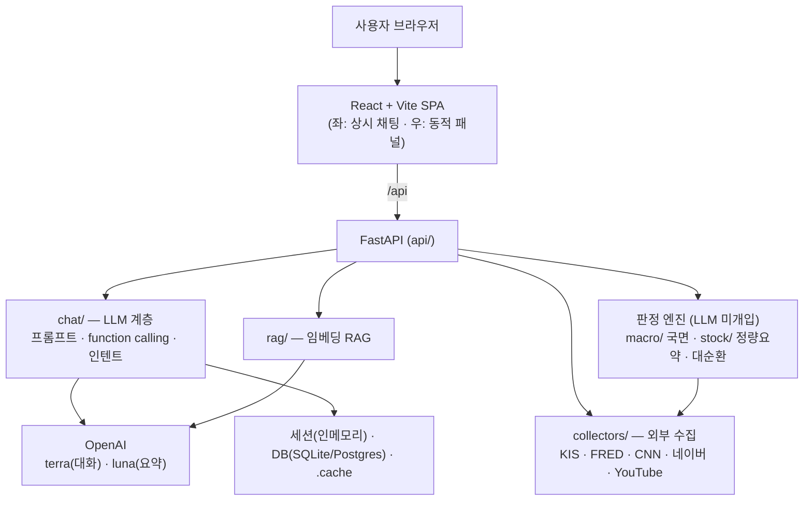
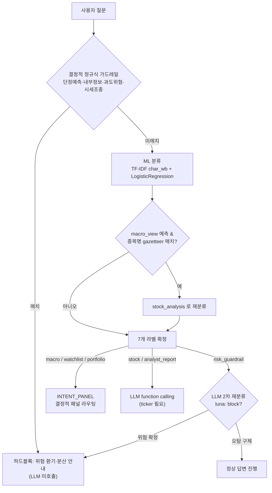
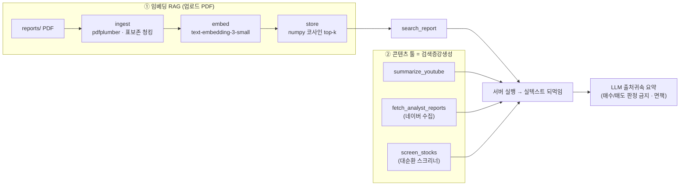
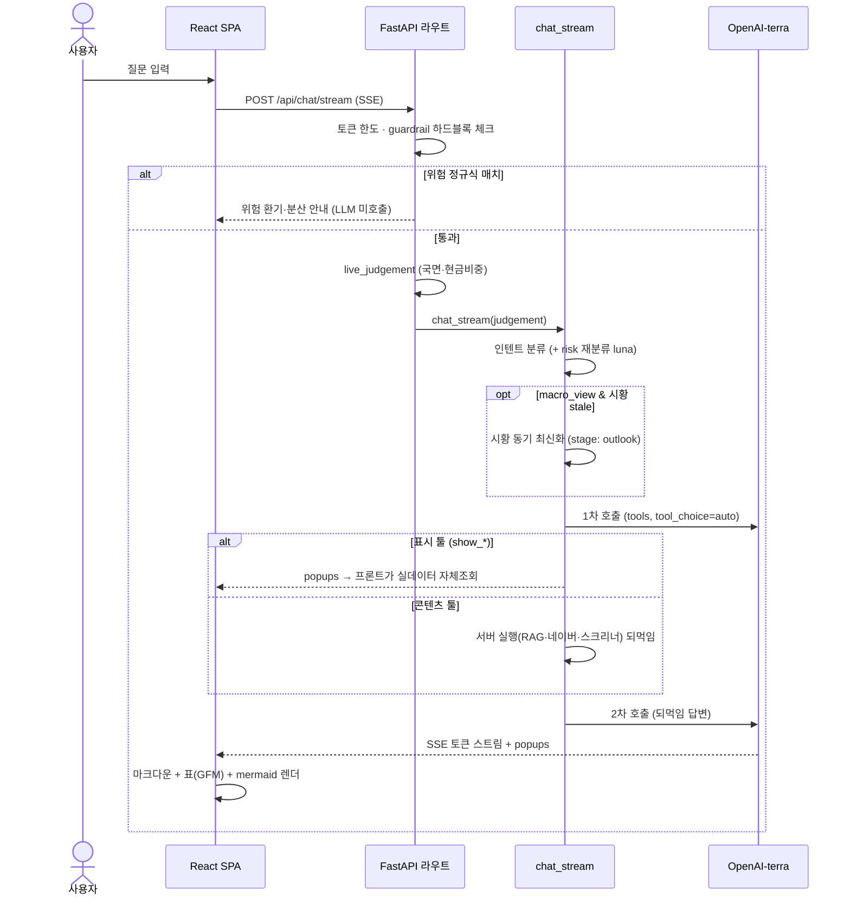
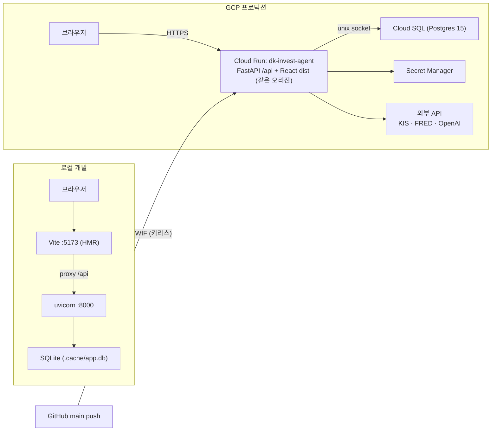

# 디케이 투자에이전트 (DK Investment Agent)

**개인 투자자용 금융 분석 AI Agent** — 시장 국면 판정부터 종목 종합리포트, LLM 챗봇, 관심종목 관리까지
하나의 웹앱으로. 연세대학교 정보대학원 · AI핀테크 *[AI핀테크 Agent 분석과 설계]* 과제(WEEK 06~10).

> **핵심 설계 철학 — "판정·수치는 코드가 확정하고, LLM은 설명만 한다."**
> 시장 국면·종목 상태 같은 **판정은 전부 결정적(deterministic) 순수 함수**가 내리고, LLM은 그 결과를 자연어로
> 설명·요약할 뿐이다. **매매 주문 API는 프로젝트 어디에도 없다**(조회·표시만). 위험 요청은 코드 가드레일로
> 차단하고, 외부 콘텐츠(증권사 리포트·영상)는 **출처를 귀속해 인용하고 면책**을 붙인다.

- **스택**: Python 3.13 · FastAPI · SQLAlchemy · scikit-learn · OpenAI · React + Vite · klinecharts
- **배포**: GCP **Cloud Run**(단일 서비스: FastAPI 가 `/api` + 빌드된 React 정적을 같은 오리진 서빙) + **Cloud SQL**(PostgreSQL) + Secret Manager · GitHub Actions(**WIF 키리스**) CI/CD 로 `main` 자동배포
- **테스트**: 백엔드 pytest **899** · 프론트 vitest **375** (hermetic; 실 API 호출은 `-m live` 로만)

---

## 1. 주요 기능

| 영역 | 기능 |
|------|------|
| **시장 국면 판정** | 경기(금리차·신용스프레드) × 심리(VIX·공포탐욕) **2축 매트릭스**로 4국면(회복/확장/과열/수축) 판정 + **역발상 권장 현금비중** · 판정근거 지표 카드(5년 히스토리) · **국면 이동 궤적(족적)** 시각화 |
| **종목 종합리포트** | 현재가·손익·재무비율·추정실적을 **번들 API** 1회 호출로 · 정량요약(CAGR·자기과거평균 PER·RSI·52주) · **예측 PER**(리서치 컨센서스) · **이동평균선 대순환**(고지로 6단계) · 일봉/주봉 × 3개월/1년/3년/10년 선택형 캔들차트 + 대순환 스테이지 리본 |
| **LLM 챗봇** | OpenAI **function calling** agent 루프 · **ML 인텐트 7분류** + 결정적 위험 가드레일 · 서버 세션 · **SSE 실시간 스트리밍** · 포트폴리오 상담 · 마크다운 렌더 |
| **워치리스트** | 관심종목 CRUD · **매수/매도 목표가** 분리 추적 + 능동 알림(도달/근접) · 스파크라인 · 종목 클릭 → 상세 이동 |
| **잔고(포트폴리오)** | 계좌 잔고·평가손익·보유종목(미니차트) — **조회 전용**(무캐시) |
| **증권사 리포트 연계** | 네이버 **애널리스트 리포트** 수집→구조화 요약→종합요약 + **"이 리포트로 상담하기"**(챗 세션 핀) · **시황(매크로) 리포트** 요약·상담·**'금일의 요약'**(최근 5개 종합·중복제거 10줄) · 업로드 PDF **RAG** 검색 · YouTube 자막 요약 |
| **회원제** | 회원가입/로그인(bcrypt·JWT) · **유저별** 관심종목·대화기록 · **유저별 KIS 키**(암호화 저장) · **RBAC + 질문 사용량 한도**(관리자 제어) |
| **기타** | 헤드라인 가입자·방문자수 통계 · 대화기록 저장/삭제/자동명명 · 시황 일별 자동 최신화 |

---

## 2. 스펙 (5주 로드맵 + 확장)

`invest_develop_PLAN.md` 의 5주 로드맵을 완성한 뒤 다수 기능을 확장했다.

| 주차 | 산출물 |
|------|--------|
| **W06** | 데이터 파이프라인 — KIS/FRED/CNN 수집기 · 캐시 3원칙 |
| **W07** | 매크로 국면 엔진 — 2축 판정 + 역발상 현금비중 |
| **W08** | 종목 종합리포트 — 정량요약 엔진 · 번들 API · 캔들차트 |
| **W09** | LLM 챗봇 — 프롬프트 라우팅 · ML 인텐트 · Tool Calling · SSE |
| **W10** | 워치리스트(모듈 3) · 구조화 리포트(Pydantic) |
| **확장** | 시황 요약·챗 상담·금일의 요약 · 국면 이동 궤적 · 이동평균선 대순환 · 선택형 차트 · 회원제(인증·RBAC·한도) · GCP 배포 · CI/CD |

---

## 3. 아키텍처

```
                         ┌──────────────────────────── 브라우저(React + Vite) ───────────────────────────┐
                         │  좌: 상시 채팅(SSE 스트리밍)   |   우: 동적 패널(국면·종목·잔고·관심종목·시황)      │
                         └───────────────────────────────────────┬───────────────────────────────────────┘
                                                                 │ 상대경로 /api (같은 오리진 · CORS 불필요)
   ┌─────────────────────────────────────────── FastAPI (api/) ──┴─────────────────────────────────────────┐
   │                                                                                                        │
   │   chat/  (LLM 계층 — 설명만)         macro/ · stock/  (결정적 판정 엔진 — 코드가 확정)                    │
   │   ├ intent  ML 7분류 + 가드레일       ├ engine.judge_regime  (2축 국면 · 순수함수)                       │
   │   ├ build_prompt  기준표 자동생성      ├ regime_history  (judge_regime 재현 → 궤적)                       │
   │   ├ chat  function calling 루프       └ summary  (정량요약 · 이동평균선 대순환)                          │
   │   └ report / analyst / market_outlook  (Pydantic 구조화 요약 · RAG)                                     │
   │                                                                                                        │
   │   collectors/  (외부 수집)   cache/  (3원칙)   auth/  (인증·RBAC·KIS암호화)   infra/  (DB·설정·병렬)      │
   └────────────────────────────────────────────────────┬───────────────────────────────────────────────┘
        │ KIS · FRED · CNN · 네이버 · YouTube · OpenAP    │ SQLAlchemy
        ▼                                                 ▼
   외부 API / 데이터 소스                          SQLite(로컬) / Cloud SQL PostgreSQL(프로덕션)
```

**계층 원칙**
- **판정은 코드(`macro/`·`stock/`), 설명은 LLM(`chat/`)** — 두 계층을 절대 섞지 않는다.
- **경계 계약**: 프론트는 백엔드 엔드포인트 계약(번들 shape·팝업 툴·판정 스키마)을 그대로 소비한다.
- **환각 차단**: 팝업 실데이터는 LLM 응답이 아니라 **프론트가 직접 조회**하고, 챗 상담 컨텍스트도 **서버가 store 에서 조회**한다(프론트 신뢰전송 없음).
- **캐시 3원칙**: 현재가·잔고 등 **실시간 값은 무캐시**, 확정 과거값·정적 문서만 캐시.
- **3중 일관성(SSOT)**: 임계값·현금비중을 프롬프트에 하드코딩하지 않고 `macro.engine` 상수 한 곳에서 코드·프롬프트·프론트가 파생.

---

## 4. 안전 설계 원칙 (프로젝트의 서명)

1. **매매 주문 API 없음** — 시세·잔고·재무는 *조회만*. 주문·체결·이체 코드는 존재하지 않는다.
2. **판정은 결정적 코드** — 국면·종목 상태(도달/근접/과열 등)는 순수 함수가 결정. LLM은 미개입.
3. **위험 요청 2층 차단** — ① 결정적 키워드 가드레일(단정예측·내부정보·과도위험·시세조종 → LLM 미호출 즉시 차단) ② ML=risk 오탐은 LLM 2차 재분류로 구제/확정.
4. **출처 귀속 + 면책** — 리포트/영상 요약은 "리포트에 따르면"으로 인용하고 면책을 고정 노출(에이전트 자체 판정 아님).
5. **개인정보·시크릿 보호** — 비밀번호 bcrypt 해시만, **KIS 키는 Fernet 암호화** DB 저장(사용 직전 복호화), 통계는 집계만(PII 0), 시크릿은 GCP Secret Manager.

---

## 5. 과제 수행 측면 — 활용 기술

LLM 애플리케이션 **5대 요소**(강의)를 프로젝트에 이렇게 구현했다 → `notebooks/투자에이전트_실행노트북.ipynb` 실행 데모.

| # | 요소 | 구현 | 기술 |
|---|------|------|------|
| 1 | **Intent Classification** | `chat/intent.py` — 7분류 + 결정적 위험 가드레일 · **인텐트→네비게이션 패널 결정적 라우팅**(`chat/intent_panel.py`) | **scikit-learn** `TfidfVectorizer(char_wb, 2–4gram)` + `LogisticRegression`(한글 무형태소) |
| 2 | **Prompt Routing** | `chat/build_prompt.py` — 필수 블록·기준표 자동생성 + `tool_choice=auto` | 상수 SSOT 기반 프롬프트 조립 |
| 3 | **RAG** | `rag/` — PDF 청킹→임베딩→코사인 top-k | **pdfplumber** · OpenAI `text-embedding-3-small` · **numpy** 코사인(FAISS 대신 의존성 절감) |
| 4 | **Tool Calling** | `chat/chat.py`·`chat/tools.py` — 표시 툴/콘텐츠 툴 | OpenAI **function calling** agent 루프 · SSE 스트리밍 tool_call 재조립 |
| 5 | **UI** | `frontend/` — 좌 채팅 + 우 동적 패널 | **React + Vite** · **klinecharts** · react-markdown · SSE |

**그 외 활용 기술**

- **백엔드**: FastAPI · SQLAlchemy 2.0 · Pydantic(구조화 리포트 안전강제) · `uv`(패키지) · `infra.parallel`(ThreadPool 병렬 수집)
- **인증/보안**: bcrypt · PyJWT · **cryptography(Fernet)** KIS 키 암호화 · email-validator
- **데이터**: requests · fredapi · fear-and-greed · pandas · **beautifulsoup4**(네이버 HTML 파싱) · youtube-transcript-api
- **DB**: SQLite(로컬) ↔ **PostgreSQL**(psycopg, 프로덕션) — `DATABASE_URL` 스왑, 방언 중립 ORM
- **프론트**: klinecharts(커스텀 오버레이·대순환 리본) · vitest(jsdom) · 순수 SVG 시각화(국면 궤적·매크로 라인차트·스파크라인)
- **인프라/배포**: Docker(멀티스테이지) · **GCP Cloud Run + Cloud SQL + Secret Manager** · **GitHub Actions + Workload Identity Federation**(키리스 CI/CD)
- **테스트/방법론**: **TDD**(Red→Green) · pytest/vitest · 적대적 다각검증(멀티에이전트 리뷰)

---

## 6. 도움을 얻은 외부 API / 데이터 소스

| API / 소스 | 용도 | 비고 |
|------------|------|------|
| **한국투자증권(KIS) Open API** (`openapi.koreainvestment.com`) | 현재가·손익·재무비율·추정실적·차트·잔고·종목마스터 | OAuth 토큰·좀비토큰 자가치유 · 조회 전용 |
| **FRED** — Federal Reserve Economic Data (`api.stlouisfed.org`) | 장단기 금리차(T10Y2Y)·HY 신용스프레드·VIX 등 매크로 지표 | `fredapi` |
| **CNN Fear & Greed Index** (`production.dataviz.cnn.io`) | 시장 심리(공포탐욕지수) | `fear-and-greed` |
| **Yahoo Finance** (`query1.finance.yahoo.com`) | VIX 보조 | |
| **네이버 증권 리서치** (`finance.naver.com`) | 애널리스트/시황 리포트 목록·PDF | robots 준수·예의 크롤링 |
| **KIS 종목마스터** (`new.real.download.dws.co.kr`) | 종목 검색 자동완성 마스터 | |
| **YouTube Transcript API** | 영상 자막 → 요약 | `youtube-transcript-api`(타임아웃 상한) |
| **OpenAI API** | 챗·요약·구조화(`gpt-5.6-luna`) · RAG 임베딩(`text-embedding-3-small`) | function tools 는 `reasoning_effort='none'` |

> **KIS API 코드는 `kis-code-assistant` MCP 로 검증된 코드를 먼저 검색**해 작성했다.

---

## 7. 실행 방법

### 로컬 (uv)

```bash
uv sync                                             # 백엔드 의존성(.venv)
uv run uvicorn api.main:app --port 8000            # 백엔드
cd frontend && npm install && npm run dev          # 프론트 → http://localhost:5173
```

### 도커 (한 번에)

```bash
docker compose up --build                          # 백엔드 :8000 + 프론트 :5173 (.env 런타임 주입)
```

### 환경 변수 (`.env`, `.env.example` 참고)

`OPENAI_API_KEY` · `FRED_API_KEY` · `KIS_APP_KEY`/`KIS_APP_SECRET`/`KIS_ACCOUNT_NO` · `JWT_SECRET` · `KIS_ENC_KEY`(Fernet) · `DATABASE_URL`(선택) — **키는 커밋하지 않는다**(gitignore).

### 테스트

```bash
uv run pytest                    # 백엔드 899 (라이브 제외; 실 API 는 -m live)
cd frontend && npm test          # 프론트 375 (vitest)
```

### 과제 실행 노트북

```bash
uv run --with jupyterlab jupyter lab notebooks/투자에이전트_실행노트북.ipynb
```

### 프로덕션 배포

`main` 푸시 → GitHub Actions(WIF) 가 테스트 후 **GCP Cloud Run** 에 자동배포. 수동 배포·인프라 셋업은
`DEPLOY_GCP.md` 참고.

---

## 8. 디렉토리 / 문서 지도

기능별 상세 지식(결정·함정·계약)은 각 디렉토리 `CLAUDE.md` 에 있다.

```
api/          FastAPI 엔드포인트(= AWS Lambda 로컬 스탠드인)
macro/        국면 판정 엔진(결정적·LLM 미개입) + 궤적 재현
stock/        종목 정량 요약 · 이동평균선 대순환
chat/         LLM 계층(인텐트·프롬프트·챗·구조화 요약·RAG 연계) — 설명만
rag/          업로드 PDF RAG(pdfplumber · 임베딩 · numpy 코사인)
collectors/   외부 수집기(KIS·FRED·CNN·네이버·YouTube)
cache/        캐시 3원칙(무캐시/확정과거 캐시)
auth/         인증·RBAC·질문 한도·유저별 KIS 키 암호화
watchlist/    관심종목(목표가·알림·유저 스코프)
infra/        DB(SQLAlchemy)·설정·병렬·암호화·사이트 통계
frontend/     React + Vite(좌 채팅 + 우 동적 패널)
notebooks/    과제 실행 노트북(5요소 데모 + 결정적 엔진 재사용 보너스)
```

- **루트 문서**: `CLAUDE.md`(설계 원칙·변경 이력) · `DOCKER.md`(로컬 도커) · `DEPLOY_GCP.md`(GCP 배포·CI/CD) · `invest_develop_PLAN.md`(원본 스펙) · `DEMO.md`(발표 데모 시나리오)

---

## 🎤 발표 자료 (Presentation Base)

> 발표 슬라이드 제작용 기초자료. 원본 계획 `invest_develop_PLAN.md`를 기준으로, 실제 구현 현황과 기술 구조·흐름을 정리한다. mermaid 다이어그램은 GitHub·앱 챗봇 양쪽에서 렌더된다.

### 1) 프로젝트 취지

**한 줄 정의** (PLAN §0): 개인 투자자를 위한 **금융 분석 어시스턴트**. 거시 시장 국면(매크로)을 **규칙 기반으로 판정**해 권장 현금비중을 산출하고, 보유·관심 종목을 기본적/기술적으로 분석하며, 챗봇이 이 정보를 종합해 자연어로 상담한다. 대화 중 필요할 때 매크로/종목 화면을 실시간 패널로 띄운다. **매매 주문은 실행하지 않고 "제안"까지만 한다.**

**문제의식 — 불변 3원칙** (PLAN §1, "변경 금지"):
1. **판단 보조자, 자동 매매자 아님** — 매수/매도 주문은 절대 실행하지 않는다(책임 소재 리스크 회피).
2. **환각 차단** — 시세·재무 등 모든 구체적 숫자는 조회한 실제 데이터에서만 인용. LLM이 숫자를 지어내지 않는다.
3. **규칙과 LLM의 역할 분리** — 국면 판정·정량 계산은 결정적 코드가 수행, LLM은 그 결과를 "설명"만 한다(재판정 금지).

**과제 성격**: 연세대학교 정보대학원 · AI핀테크 *[AI핀테크 Agent 분석과 설계]* — 5주(WEEK 06~10) "Small Scope" 금융 AI Agent.

**계획 → 실제 구현 (진화 스토리)** — 5주 로드맵을 완주한 뒤 확장하며 스택이 진화했다. 단, 핵심 안전 원칙은 처음부터 끝까지 불변이다.

| 항목 | 원본 계획 (PLAN) | 실제 구현 |
|---|---|---|
| 인프라 | AWS (Lambda·DynamoDB·ElastiCache) | **GCP** Cloud Run + Cloud SQL(Postgres) + Secret Manager |
| LLM 모델 | gpt-4o 단일 | **gpt-5.6 하이브리드** (terra 대화 · luna 요약) + text-embedding-3-small |
| 국면 판정 | 7지표 가중 투표 (4단계) | **경기×심리 2축 매트릭스** (4국면) + 국면 이동 궤적 |
| 인텐트 분류 | 6분류 (few-shot) | **ML 7분류** (TF-IDF + LogisticRegression) + 2층 위험 가드레일 |
| 데이터 저장 | DynamoDB | **SQLAlchemy** (SQLite ↔ Postgres 스왑) |
| **불변 유지** | — | 매매 API 0 · 판정=코드 · 3중 일관성(SSOT) · 현재가 무캐시 · TDD |

---

### 2) 주로 사용한 기술

**아키텍처 개요** — 프론트(React) ↔ FastAPI ↔ 4계층(챗·LLM / 판정 엔진(LLM 미개입) / 외부 수집 / RAG). 판정은 코드가, 설명은 LLM이 담당한다.



**① 하이브리드 AI 모델** (`chat/tools.py` — 2상수 SSOT, 하드코딩 0):

| 모델 상수 | 값 | 용도 |
|---|---|---|
| `CHAT_MODEL` | **gpt-5.6-terra** (상위) | 사용자 대면 대화 — `chat`/`chat_stream` 1차(tools)·2차(되먹임 답변) |
| `REPORT_MODEL` | **gpt-5.6-luna** (하위) | 리포트·애널리스트·시황 구조화 요약 · 위험 재분류 · 학습데이터 생성 |
| `EMBED_MODEL` | text-embedding-3-small | RAG 청크·쿼리 임베딩 |

> 대화 품질은 상위 terra, 스키마 강제 정형 작업은 하위 luna로 비용·지연 절감. 둘 다 추론형이라 function tools 사용 시 `reasoning_effort: none` 필수.

**② 툴 콜링 (Function Calling)** — 두 계열의 되먹임 방식이 다르다.
- **표시 툴** (`show_stock_report`·`show_macro_dashboard`·`show_watchlist`·`show_balance`·`show_screener`·`manage_watchlist`): `{ok:True}` 확인만 되먹이고 **실데이터는 프론트가 직접 조회**(환각 차단). LLM은 "무엇을 띄울지"만 결정.
- **콘텐츠 툴** (`summarize_youtube`·`search_report`·`fetch_analyst_reports`·`screen_stocks`): **서버가 실행해 실제 텍스트를 되먹여** LLM이 출처 귀속 요약. `chat.py`는 tool_call을 **범용 포워딩**(새 표시 툴 추가 시 무변경).

**③ 인텐트 분류 + 2층 위험 가드레일** — 사용자 질문을 7라벨로 분류해 우측 패널을 결정적으로 라우팅하고, 위험 질의는 2층으로 차단한다.



> 7라벨: `macro_view`·`stock_analysis`·`portfolio_advice`·`watchlist_mgmt`·`general_qa`·`analyst_report`·`risk_guardrail`. Layer 1 = 결정적 정규식(LLM 0), Layer 2 = ML→LLM 재분류(오탐 구제/위험 확정).

**④ RAG (검색증강생성)** — 두 갈래. (i) 업로드 PDF는 임베딩 RAG, (ii) 소량·실시간 데이터는 "콘텐츠 툴이 곧 검색증강생성".



**⑤ 판정 엔진 (LLM 미개입, 결정적)**:
- `macro/engine.py` — 4지표를 **경기×심리 2축**으로 점수화 → 2×2 매트릭스 국면 판정 → **역발상 현금비중**(회복 40% · 확장 60% · 과열 80% · 수축 20%) + VIX 패닉 표시 + 신뢰도. 임계값은 `THRESHOLDS` 상수 하나가 원본(프롬프트 기준표·스키마 범위가 이를 공유 = 3중 일관성).
- `stock/summary.py` — CAGR · **자기 과거평균 대비 PER**(저평가/적정/고평가) · RSI · MA · 52주 위치 · **이동평균선 대순환(고지로 6단계)**. `stock/screener.py` — 시총상위 유니버스를 대순환 단계로 스캔.

**⑥ 요청 → 응답 흐름 (SSE 스트리밍)** — 한 턴이 흐르는 전 과정. 위험 하드블록은 LLM을 아예 부르지 않는다.



---

### 3) 구축 환경

**기술 스택 / 버전**:

| 구분 | 스택 |
|---|---|
| 백엔드 | Python 3.13 · **uv** · FastAPI · SQLAlchemy 2 · scikit-learn · pdfplumber · psycopg · bcrypt · PyJWT · cryptography(Fernet) · openai |
| 프론트 | React 18 · **Vite 6** · vitest · react-markdown · remark-gfm · **mermaid** · klinecharts |
| AI | OpenAI **gpt-5.6-terra / gpt-5.6-luna** · text-embedding-3-small |
| 외부 데이터 | KIS Open API · FRED · CNN 공포탐욕 · DART(선택) · 네이버 리서치 · YouTube |
| 인프라 | GCP Cloud Run · Cloud SQL(Postgres) · Secret Manager · GitHub Actions(WIF) |

**로컬 실행**:
```bash
# 네이티브
uv run uvicorn api.main:app --port 8000        # 백엔드
cd frontend && npm run dev                       # 프론트 → http://localhost:5173 (Vite가 /api 프록시)
# 도커
docker compose up --build                         # 백엔드+프론트 2컨테이너
```

**프로덕션 배포 (GCP) & CI/CD**:
- **단일 Cloud Run 서비스**(`dk-invest-agent`, `asia-northeast3`)가 FastAPI `/api`와 빌드된 React `dist`를 **같은 오리진**에서 서빙(멀티스테이지 `Dockerfile`) → CORS·프론트 코드 변경 0, SSE 그대로.
- **Cloud SQL Postgres** — `DATABASE_URL` 스왑(로컬 SQLite ↔ 프로덕션 Postgres). 시크릿은 **Secret Manager** 주입.
- **CI/CD** — GitHub Actions(`main` push·PR): 백엔드 pytest · 프론트 vitest+build → 통과 시 **Cloud Run 자동 배포**(WIF 키리스 인증, 워크플로에 시크릿 값 0).



**테스트 규모**: 백엔드 pytest **1,004** · 프론트 vitest **472** (hermetic 기본 — 실 외부 API 호출은 `-m live` 마커로 격리).

**인증 / 보안**: bcrypt + JWT(`get_current_user` 게이트) · **KIS 자격증명 Fernet 암호화 DB 저장**(복호화는 사용 직전, 로깅·응답 금지) · RBAC(관리자) · 질문 사용량 한도(KST 매일 리셋·관리자 무제한).

---

### 4) 향후 개선안

**인프라 / 운영**
- 세션 인메모리 → **Redis/DynamoDB** 이전 (서버 재시작 시 세션 손실 해소).
- DB 스키마 **Alembic 마이그레이션** 도입 (현재 `create_all` + 경량 `ADD COLUMN`).
- **시황 프리웜 스케줄러** (매일 자정 미리 수집·캐시 → 챗 첫 stale 질문의 ~45초 지연 제거, PLAN §7 P2).

**기능**
- RAG **스캔/이미지 PDF vision-OCR 폴백** (현재 텍스트 PDF만) · 벡터스토어 **pgvector/FAISS** 확장.
- **실시간 시세 WebSocket 스트리밍** (PLAN의 API Gateway/WebSocket 취지).
- 프로덕션 **YouTube 자막** — 데이터센터 IP 차단 → residential 프록시 도입.
- 스크리너 **이중 실행 통합** (백엔드 되먹임 + 프론트 자체조회).

**품질 / 관측성**
- **E2E 테스트**(Playwright) · live 테스트 CI 게이팅.
- **Cloud Logging/모니터링 대시보드** · 에러 추적.
- 인텐트 **외국주·2글자 종목 gazetteer 확장** (현재 best-effort) · JWT 리프레시 토큰 · rate limiting.

---

## 면책

이 프로젝트는 **교육용 과제**이며 투자 자문·매매 권유가 아니다. 모든 판정·요약은 참고용이고, 투자 판단과
그 결과는 전적으로 본인 책임이다. 매매 주문 기능은 구현되어 있지 않다.
